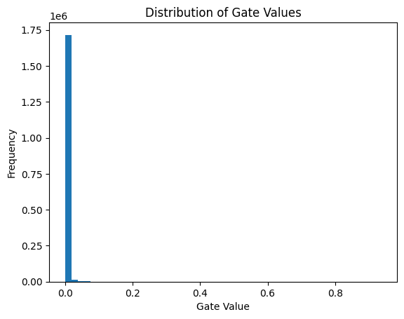

# Self-Pruning Neural Network Report

## 1. Why L1 Penalty on Sigmoid Gates Encourages Sparsity

In this model, each weight is associated with a learnable gate parameter. These gate parameters pass through a sigmoid function to determine their values between 0 and 1. The effective weight used during the calculation is the product of the original weight and its corresponding gate.

To encourage sparsity, an L1 penalty is applied to gate values. The L1 (sum of absolute values) criterion enhances rarity by penalizing non-zero values. Since the sigmoid output is always positive, the L1 loss actually becomes the sum of all gate values.

Reducing this term pushes many gate values toward zero. When the gate approaches zero, its corresponding weight is effectively removed from the network. This results in a sparse model where only the most important connections remain active.

---

## 2. Results for Different λ Values

| Lambda | Test Accuracy (%) | Sparsity Level (%) |
| ------ | ----------------- | ------------------ |
| 0.0001 | 37.17             | 49.16              |
| 0.001  | 39.48             | 81.64              |
| 0.01   | 39.64             | 97.68              |

### Observation

As the value of λ increases, the level of sparsity increases significantly. This indicates that L1 regularization effectively reduces the network. However, it comes with a trade-in: test accuracy remains relatively low and does not improve significantly. This indicates that excessive pruning can limit the ability of a model to learn complex patterns.

---

## 3. Distribution of Gate Values (Best Model)

The histogram below shows the distribution of gate values for the best-performing model (λ = 0.0001).

* A large spike near zero indicates that many weights have been effectively pruned.

### Interpretation

The observed distribution shows a strong concentration of gate values near zero, indicating aggressive pruning. However, the absence of a distinct cluster away from zero suggests that the model struggles to clearly separate important and unimportant weights. This explains the relatively low accuracy despite high sparsity.

---

## 4. Conclusion

This experiment demonstrates that adding an L1 penalty on gate values successfully induces sparsity in the network. However, there is a clear trade-off between sparsity and performance. Higher values of λ lead to more aggressive pruning but can negatively impact the model’s accuracy. Selecting an appropriate λ is crucial to balance model compression and predictive performance.
